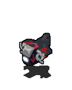
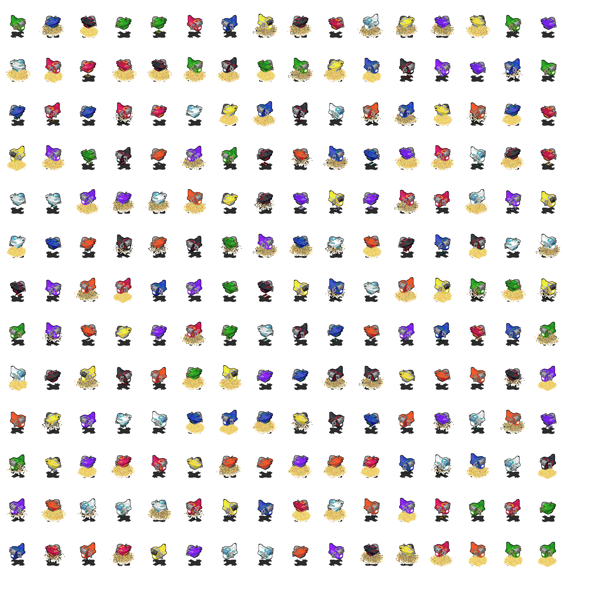
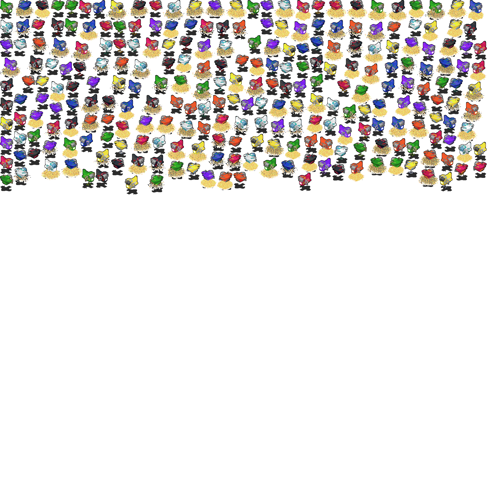

When loading an image, it starts on the CPU as a `Pixmap`, is potentially processsed, and is then uploaded to the GPU as a `Texture`.

## Pixmaps
To load a pixmap, read your file into an off-heap `ByteBuffer` and call `Pixmap.load`.
```java
Path path = Paths.get("image.png");
ByteBuffer buffer = ...;
try(FileChannel channel = FileChannel.open(Path.of(path))) {
  long size = channel.size();
  if(size > Integer.MAX_VALUE) {
  	throw new IllegalStateException("Cannot read image over 2GB");
  }
  buffer = MemoryUtil.memAlloc((int) size);
  channel.read(buffer);
  buffer.flip();
}

// you can also source it from a byte[], but this requires copying the whole buffer
// and is thus less efficient then reading directly into an off-heap buffer
byte[] data = ...;
buffer = MemoryUtil.memAlloc(data.length);
buffer.put(data);
buffer.flip();

Pixmap pixmap = Pixmap.load(buffer, PixelFormat.RGBA, /*flipVertically*/ false);
MemoryUtil.memFree(buffer);
```
The `flipVertically` parameter is optional and defaults to false. 
The `PixelFormat` parameter can also be omitted, but this isn't recommended as it will use whatever format is present in the file, which can cause issues when using methods that require a specific format.

Pixmaps are backed by a native buffer and must be `dispose`d of when you're done.
```java
pixmap.dispose();
```

### Copying part of one pixmap to another
Pixmaps can copy data from another provided the target is big enough and the pixmaps use the same pixel format.
```java
Pixmap a = ...; // make sure to explictely specify PixelFormat.RGBA
Pixmap b = ...;
Pixmap big = Pixmap.create(
  PixelFormat.RGBA,
  /*width*/ a.width + b.width,
  /*height*/ Math.max(a.height, b.width)
);
big.copyFrom(a, /*targetX*/ 0, /*targetY*/ 0);
big.copyFrom(b, /*targetX*/ a.width, /*targetY*/ 0);
```

### Writing a pixmap to a file
Pixmaps can either be written to files or custom callbacks.
Writing directly to file paths is faster but not required.
```java
Pixmap pixmap = ...;
pixmap.writePng("/home/thosea/Downloads/test.png");
pixmap.writeJpg(/*quality*/ 100, "/home/thosea/Downloads/test.jpg");
pixmap.writePng(buffer -> {
  // this callback will be called any number of times with different parts of the file buffer
  appendToFile(buffer);
});
```

## Textures
To use a texture, create it, set filter/wrap options and upload to it.
```java
Texture.create(type);
// type can be anything listed at https://registry.khronos.org/OpenGL-Refpages/gl4/html/glBindTexture.xhtml
// you can use create2D to make a texture of type GL_TEXTURE_2D, which is the most common
Texture texture = Texture.create2D();
texture.setWrap(TextureWrap.REPEAT);
// you can also use setHorizontalWrap and setVerticalWrap individually
texture.setMinificationFilter(TextureFilter.LINEAR);
texture.setMagnificationFilter(TextureFilter.NEAREST);
texture.upload(pixmap);
// optionally, you can enable compression so the GPU compresses the texture in its memory
// texture.upload(pixmap, /*compress*/ true);
// if you upload the data directly with glBufferData 
// instead of using upload, be sure to call texture.setKnownSize as well

// to bind the buffer for modifications (done automatically when created):
texture.bindBuffer();
// to bind the buffer for rendering:
texture.bindTexture(/*slot*/ 0); // binds to GL_TEXTURE0
texture.bindTexture(/*slot*/ 1); // binds to GL_TEXTURE1
```

## Atlas packing
Binding a texture is relatively expensive so it's common to pack many small images into one big image called an atlas and draw different regions of it.

### Directly using RectPacker
You can use `RectPacker` to directly pack rectangles though this isn't recommended.
```java
RectPacker packer = RectPacker.create(/*width*/ 100, /*height*/ 50);
// pack two 50x50 rectangles in a big 100x50 one
RectangleSlot slot1 = packer.pack(/*width*/ 50, /*height*/ 50);
RectangleSlot slot2 = packer.pack(50, 50);
packer.dispose();
System.out.println(slot1);
System.out.println(slot2);
```
```
RectangleSlot[x=0, y=0, width=50, height=50]
RectangleSlot[x=50, y=0, width=50, height=50]
```
If a rectangle fails to pack in the space, `null` will be returned.

### Pixmap trimming
In animations, it's common to leave a lot of whitespace on the edges so every frame is positioned relative to another.  
  

If this whitespace is kept, it wastes a lot of space on the atlas.

Pixmaps can optionally be trimmed (previously called "whitespace stripping" in libGDX) which gives you the range of non-empty pixels.
This trim can then be used to avoid copying empty pixels into an atlas while using the calculated offsets to position the image.  
*(Note: pixmap trimming only works on pixmaps formatted as `PixelFormat.RGBA`)*
```java
Pixmap pixmap = ...;
PixmapTrim trim = PixmapTrimmer.trim(pixmap);
// (calling this doesn't modify the actual Pixmap)
int top = trim.top(); // the Y coordinate of the first non-empty row
int bottom = trim.bottom(); // the Y coordinate of the last empty row, can be up to height (which is out of bounds by 1)
int left = trim.left(); // the X coordinate of the first non-empty column
int right = trim.right(); // the X coordinate of the last empty column, can be up to width (which is out of bounds by 1)
int width = trim.width(); // width of the trimmed region
int height = trim.height(); // height of the trimmed region
```

Atlas packing without and with pixmap trimming:

|Without trim|With trim|
|:---:|:---:|
|||

### Using PixmapPacker
PixmapPacker internally uses `RectPacker` but also handles using multiple pages, copying pixmap data and factoring in pixmap trims.
You can use it like this:
```java
// the generic here is the key type for each packed entry.
// it can be any object that implements equals/hashCode, like a record,
// but for simplicity we'll just use a string here
PixmapPacker<String> packer = PixmapPacker.create(
  PixelFormat.RGBA, // all input pixmaps also must use this format
  /*width*/ 1024, /*height*/ 1024,
  /*padding*/ 1, // it's recommended to add a bit of padding to avoid artifacts from neighboring images when rendering
  /*maxPages*/ 3 // you can omit this parameter to have no page limit
);

Map<String, Pixmap> pixmaps = loadSomePixmaps();
for(Entry<String, Pixmap> entry : pixmaps.entrySet()) {
  String key = entry.getKey();
  Pixmap pixmap = entry.getValue();
  PixmapTrim trim = PixmapTrimmer.trim(pixmap);
  // you can omit the key parameter or omit the trim parameter if you don't want your pixmap to be trimmed
  page.pack(key, pixmap, trim);
  pixmap.dispose(); // we don't need our input anymore
}

record AtlasEntry(TextureRegion region, PixmapTrim trim) {}
Map<String, AtlasEntry> regions = new HashMap<>();
for(Page<String> page : packer.getPages()) {
  Pixmap pixmap = page.getPixmap();
  Texture texture = Texture.create2D();
  texture.upload(page.pixmap);
  for(PackedEntry<PixmapKey> entry : page.getPacked()) {
    String key = entry.key();
    RectangleSlot slot = entry.slot();
    TextureRegion region = slot.toTextureRegion(texture);
    PixmapTrim trim = entry.trim();
    regions.put(key, new AtlasEntry(region, trim));
  }
}
// disposes the pages
packer.dispose();

// now we have all our atlas regions in a map
public void render(SpriteBatch batch, String name, float x, float y) {
  AtlasEntry entry = regions.get(name);
  TextureRegion region = entry.region();
  PixmapTrim trim = region.trim();
  batch.draw(
    region,
    x + trim.left(),
    y + trim.top()
  );
}
```